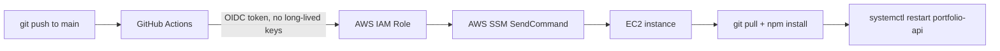

# Portfolio API

Production Node.js/Express backend for [sheharzad-portfolio.vercel.app](https://sheharzad-portfolio.vercel.app), deployed on AWS EC2 with a full CI/CD pipeline, HTTPS, and automated process supervision.

## Live

- **API health check:** https://sheharzad-portfolio.duckdns.org/api/health
- **Consumed by:** https://sheharzad-portfolio.vercel.app (contact form)

```bash
curl https://sheharzad-portfolio.duckdns.org/api/health
# {"status":"ok","service":"portfolio-api"}
```

## Architecture

**Request flow:**


**Deployment flow:**



## Tech Stack

| Layer | Technology |
|---|---|
| Runtime | Node.js, Express 5 |
| Email | [Resend](https://resend.com) |
| Reverse proxy | Nginx |
| Process supervision | systemd |
| TLS | Let's Encrypt (Certbot), auto-renewed via systemd timer |
| DNS | DuckDNS (free dynamic DNS — no domain purchased) |
| Hosting | AWS EC2 (`eu-north-1`) |
| CI/CD | GitHub Actions → AWS OIDC → AWS SSM |

## Infrastructure

- The API runs as a plain Node process (`server.js`), supervised by **systemd** (`portfolio-api.service`) so it restarts automatically on crash and on instance reboot.
- **Nginx** terminates TLS and reverse-proxies `/api/` to the app on `127.0.0.1:3000`.
- **HTTPS** is provided by a free Let's Encrypt certificate. Note: Let's Encrypt will not issue certificates for AWS's default `*.compute.amazonaws.com` hostnames, so a free **DuckDNS** subdomain is used instead of a purchased domain.
- Nginx config, the systemd unit file, and the Certbot renewal timer are currently configured directly on the EC2 instance via SSM — they are **not yet version-controlled** in this repository (no infrastructure-as-code tooling in place).

## CI/CD Pipeline

Defined in [`.github/workflows/deploy.yml`](.github/workflows/deploy.yml). On every push to `main`:

1. GitHub Actions checks out the repo.
2. It authenticates to AWS using **OIDC** — GitHub issues a short-lived identity token, which the workflow exchanges for temporary AWS credentials via `sts:AssumeRoleWithWebIdentity`. No AWS access keys are stored in GitHub.
3. It calls **AWS SSM `send-command`** to run a shell script on the EC2 instance: `git fetch` + `git reset --hard origin/main`, `npm install --production`, then `systemctl restart portfolio-api`.

**Known limitation:** the SSM script does not currently use `set -e`, so if an individual step fails, later steps still execute and the job can report success without the code actually having updated. This was the root cause of one real incident (see below) and is a good candidate for a future fix.

## AWS OIDC Authentication

The IAM role's trust policy restricts `AssumeRoleWithWebIdentity` to this specific repository and branch via the `token.actions.githubusercontent.com` OIDC provider, matching on the `aud` and `sub` claims GitHub embeds in its identity token. This avoids storing any long-lived AWS credentials as GitHub secrets.

## Nginx + HTTPS

Nginx listens on 80/443 and proxies `/api/*` to the Express app. Key detail: `proxy_pass` **without** a trailing slash preserves the full request path (`/api/health` reaches the app as `/api/health`) — a URI-bearing `proxy_pass` (with a trailing slash) would instead strip the `/api/` prefix. HTTP requests are redirected to HTTPS.

## systemd Process Supervision

`portfolio-api.service` runs `node server.js` as a supervised process:
- Restarts automatically on crash (`Restart=on-failure`)
- Starts automatically on instance boot
- Replaced an earlier setup where the app was a bare, unsupervised `node` process — a real outage this fixed (see below)

## Resend Email Integration

`POST /api/contact` sends an email via the [Resend](https://resend.com) API using `resend.emails.send()`, from Resend's default sandbox sending address (`onboarding@resend.dev`), to the site owner's inbox, with the submitter's email set as `replyTo`. The Resend client is constructed at module load time, so a missing `RESEND_API_KEY` crashes the whole process on startup — not just the contact route (see Environment Variables).

## CORS / Security

CORS is locked to a single allowed origin:

```js
app.use(cors({
  origin: "https://sheharzad-portfolio.vercel.app"
}));
```

Two things that matter here: the CORS middleware **must be registered before the routes it protects** (Express applies middleware in registration order), and the `origin` value must **not** have a trailing slash — browsers never send a trailing slash in the `Origin` header, so a mismatched slash silently blocks every request. Both were real bugs encountered during development (see below).

## API Endpoints

| Method | Path | Description |
|---|---|---|
| GET | `/health` | Health check (no `/api` prefix) |
| GET | `/api/health` | Health check (used by nginx/public callers) |
| GET | `/api/message` | Static test message |
| POST | `/api/contact` | Accepts `{ name, email, message }`, sends an email via Resend |

## Environment Variables

| Variable | Required | Description |
|---|---|---|
| `RESEND_API_KEY` | Yes | Resend API key used to send contact-form emails. Set in a local `.env` file (gitignored) for development; set as a systemd environment variable on the EC2 instance for production. Never committed. |

See [`.env.example`](.env.example) for the expected format.

## Deployment Flow

```
git push origin main
  → GitHub Actions triggered
  → OIDC → temporary AWS credentials
  → AWS SSM send-command executed against the EC2 instance
  → git reset --hard origin/main + npm install --production
  → systemctl restart portfolio-api
```

## Problems Encountered & Solutions

1. **Nginx `proxy_pass` trailing slash** — a trailing slash on `proxy_pass` was silently stripping the `/api/` prefix from every request, causing routes to 404 unpredictably. Removed the trailing slash so the full path is preserved.
2. **No process supervisor** — the app originally ran as a bare, unsupervised `node` process. A crash or reboot meant permanent downtime. Fixed by creating and enabling a systemd service.
3. **GitHub OIDC trust policy mismatch** — `AssumeRoleWithWebIdentity` failed with "Not authorized." Root cause: the repository's OIDC subject claim included immutable owner/repo IDs (`repo:owner@id/repo@id:ref:...`), which the IAM trust policy's `sub` condition didn't account for. Fixed by updating the trust policy to match the actual claim format.
4. **Deploy ran `git pull` as root against a repo owned by another user** — git's ownership protection silently refused the update, while the deploy job still reported success (see CI/CD limitation above). Fixed with `git config --global --add safe.directory`.
5. **CORS middleware registered after routes** — meant CORS never actually applied, since Express processes middleware in registration order. Moved it before all route definitions.
6. **CORS `origin` had a trailing slash** — never matched the browser's `Origin` header, silently blocking every cross-origin request. Removed the trailing slash.
7. **DNS pointed at the wrong machine** — used `ifconfig.me`/`api.ipify.org` from a local laptop to "verify" the server's public IP; those services only report the IP of whichever machine calls them, so it returned the laptop's IP, not the server's. This briefly took production DNS down. Fixed using the EC2 instance's actual public IP (obtained authoritatively via `aws ec2 describe-instances`), and re-verified with `nslookup` against a public resolver.

## Testing / Verification

Verified via `curl` against both the internal port and the public HTTPS endpoint, plus real end-to-end submissions:

```bash
# Direct to the app (bypassing nginx)
curl http://127.0.0.1:3000/api/health

# Through nginx, over HTTPS
curl https://sheharzad-portfolio.duckdns.org/api/health
curl https://sheharzad-portfolio.duckdns.org/api/message

# CORS preflight
curl -i -X OPTIONS https://sheharzad-portfolio.duckdns.org/api/contact \
  -H "Origin: https://sheharzad-portfolio.vercel.app" \
  -H "Access-Control-Request-Method: POST"

# Full contact flow
curl -X POST https://sheharzad-portfolio.duckdns.org/api/contact \
  -H "Content-Type: application/json" \
  -d '{"name":"Test","email":"you@example.com","message":"Hello"}'
```

A real submission through the live Vercel site was confirmed to reach the backend and deliver an email to the site owner's inbox.

## Project Structure

```
portfolio-api/
├── .github/
│   └── workflows/
│       └── deploy.yml     # CI/CD: GitHub Actions → OIDC → SSM
├── .env.example            # Documents required env vars (no real values)
├── .gitignore
├── package.json
├── package-lock.json
├── server.js                # Express app, routes, CORS, Resend integration
└── README.md
```

Nginx config, the systemd unit, and the Certbot renewal timer live on the EC2 instance itself, not in this repo.

## Local Development

```bash
git clone https://github.com/sheharzad-developer/portfolio-api.git
cd portfolio-api
npm install

# Create a .env file (gitignored) with:
# RESEND_API_KEY=your_resend_api_key

node server.js
# API now running at http://127.0.0.1:3000
```

## Production Deployment Overview

The API runs on an AWS EC2 instance in `eu-north-1`, bound to `127.0.0.1:3000` and only reachable externally through Nginx, which terminates HTTPS and reverse-proxies `/api/*`. systemd keeps the process alive across crashes and reboots. Deploys are fully automated: pushing to `main` triggers GitHub Actions, which authenticates to AWS via OIDC (no stored credentials) and uses AWS SSM to update and restart the service on the instance — no manual SSH deployment step.

## Lessons Learned

- **Reverse proxy path handling**: whether `proxy_pass` has a trailing slash fundamentally changes whether the matched location prefix is stripped from the forwarded request — easy to get backwards, and the failure mode (silent 404s) doesn't obviously point at the cause.
- **Process supervision isn't optional** — an unsupervised process is a single crash away from a permanent outage. systemd (or an equivalent) should be part of the initial setup, not an afterthought.
- **OIDC/IAM trust policies must match the exact claim format** the identity provider actually sends — GitHub's subject claim format can include immutable owner/repo IDs depending on repository settings, and a trust policy written for the "obvious" format will fail with a generic, unhelpful "not authorized" error.
- **Deployment scripts need explicit failure propagation** (`set -e` or equivalent) — otherwise a failed step can be silently swallowed by a later step that succeeds, and the pipeline reports green while having deployed nothing.
- **Middleware order matters in Express** — CORS (or any middleware) registered after the routes it's meant to protect never actually runs.
- **DNS changes need independent verification** — checking a hostname against a resolver from the same machine that just updated it can produce a false positive; verify from an independent source, and always confirm identity via an authoritative source (in this case, `aws ec2 describe-instances`), not a self-reporting tool.
- **A server's public IP and the IP of the machine running an IP-lookup tool are not the same thing** — `ifconfig.me`, `api.ipify.org`, and similar services report the caller's IP, not any other server's. Using them to "verify" a different machine's identity is a category error that can silently break DNS.
- **End-to-end testing catches what unit-level testing can't** — confirming a real form submission through the live frontend actually delivered an email was the only way to be certain the full chain (frontend → HTTPS → DNS → nginx → Express → Resend → inbox) genuinely worked, as opposed to each piece working in isolation.
